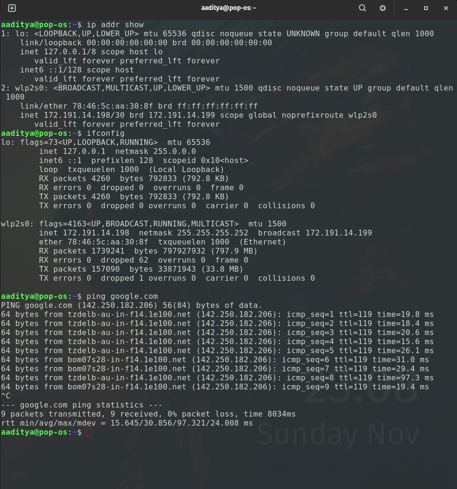
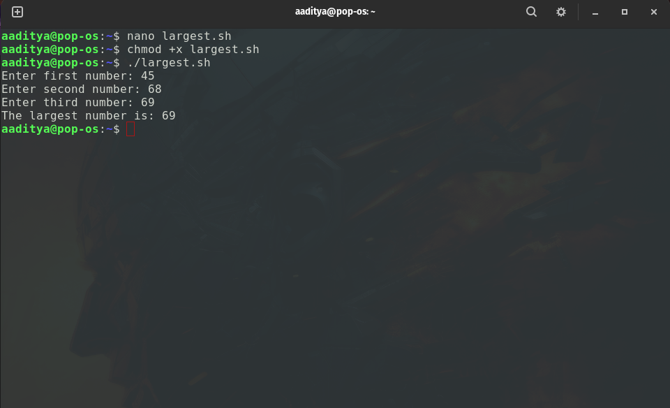
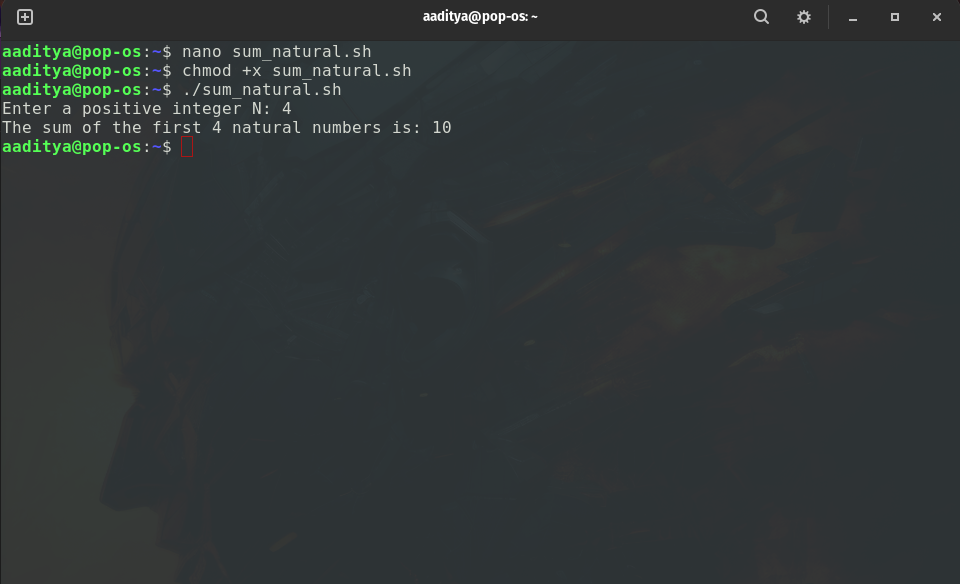

### ASSIGNMENT:1
### ADITYA MISHRA BATCH-78 590029219
### Q1: FILE AND DIRECTORY COMMANDS
* Create a directory called My Linux Files in your home folder. Inside it,create file1.txt, file2.txt, and file3.txt.Display the list of files with detailed information.

* #### 1.Create a directory named MyLinuxFiles in your home folder
`mkdir ~/MyLinuxFiles`
* #### 2.Move into the new directory
`cd ~/MyLinuxFiles`
* #### 3.Create the three text files.
`touch file1.txt file2.txt file3.txt`
* #### 4.Verify that the files were created.
`ls`
* #### 5.Display the files with detailed information.
`ls -l`
### Output:

### Q2: File Permissions
* Change the permissions of file1.txt so that the owner can read and write, the group can read
only, and others have no access. Verify the permissions.

#### 1. Open the Terminal
Open your Linux or macOS terminal (or Git Bash/WSL on Windows).
#### 2. Go to the Directory Containing `file1.txt`
Use the `cd` command to navigate:
`cd /path/to/your/directory`
#### 3.Change the Permissions
Use chmod to set:

* Owner: read + write

* Group: read

* Others: no access
`chmod 640 file1.txt`
#### 4. Verify the Permission Change
Use `ls -l` to list file details:
`ls -l file1.txt`
### Output:


#### Meaning:
* rw- → Owner can read and write

* r-- → Group can read

* --- → Others have no access
### Q3:Text Processing
Use the grep command to find all lines containing the word "Linux" in a file named
notes.txt. Count how many lines contain this word.
#### 1 — Open the Terminal
Open your Linux/macOS terminal or your command-line tool.
#### 2 — Navigate to the Directory
Move to the folder that contains `notes.txt`:
`cd /path/to/your/directory`
#### 3 — Find All Lines Containing the Word “Linux”
Use the `grep` command:
grep "Linux" notes.txt
#### 4 — Count the Number of Matching Lines
Use `grep` with the `-c `(count) option:
grep -c "Linux" notes.txt
### Output:

#### Q4:Redirection and Pipes
• Write a command to display the contents of file1.txt, and save the sorted output into a file
named sorted.txt.
#### 1 — Open the Terminal
Open your Linux or macOS terminal (or Git Bash/WSL on Windows).
#### 2 — Navigate to the Directory
Move to the folder where `file1.txt` is located:
#### 3 — Use a Pipe to Sort the File Contents
Use the cat command to display the contents, then pipe (|) the output into the sort command.
`cat file1.txt | sort > sorted.txt`
#### 4 — Verify the Output File
Check that `sorted.txt` was created:
`ls -l`
### Output


### Q5: Shell Scripting (Arithmetic)
• Write a shell script that takes two numbers as input from the user and prints their sum,
difference, product, and quotient. Handle division by zero appropriately.
#### 1 — Create a new script file.
`nano arithmetic.sh`
#### 2 — Paste the script into the file
```
#!/bin/bash

# Ask user for two numbers
read -p "Enter first number: " num1
read -p "Enter second number: " num2

# Perform arithmetic
sum=$((num1 + num2))
diff=$((num1 - num2))
prod=$((num1 * num2))

# Print results
echo "Sum: $sum"
echo "Difference: $diff"
echo "Product: $prod"

# Division with zero check
if [ "$num2" -eq 0 ]; then
    echo "Quotient: Error! Division by zero is not allowed."
else
    quotient=$((num1 / num2))
    echo "Quotient: $quotient"
fi
```
#### 3 — Save and exit

* Press CTRL + O, then ENTER

* Press CTRL + X
#### 4 — Make the script executable
`chmod +x arithmetic.sh`
#### 5 — Run the script
`./arithmetic.sh`
### Output:


### Q6:File Searching
• Use the find command to search for all .txt files in your home directory that were modified
in the last 7 days.
#### 1 — Open the Terminal

Open your Linux or macOS terminal (or WSL/Git Bash on Windows).
#### 2 — Navigate to Your Home Directory

Although not required, you can move to the home directory explicitly:
`cd ~`
#### 3 — Use the find Command

Run the find command to search for all `.txt` files modified within the last 7 days:
`find ~ -name "*.txt" -mtime -7`
#### 4 — Understand the Command

* find ~ → searches in your home directory

* -name "*.txt" → matches all .txt files

* -mtime -7 → modified less than 7 days ago

* (negative -7 means “within the last 7 days”)
### Output:


### Q7:Archiving and Compression
• Create a compressed archive of the directory MyLinuxFiles using tar and gzip. Then extract
it to verify its contents.
#### 1 — Open the Terminal

Open your Linux or macOS terminal.
#### 2 — Navigate to the Directory Containing `MyLinuxFiles`
`cd /path/to/parent/directory`
#### 3 — Create a Compressed Archive Using tar + gzip

Use the -czvf options:

* c → create

* z → compress with gzip

* v → verbose (show progress)

* f → specify filename

`tar -czvf MyLinuxFiles.tar.gz MyLinuxFiles`
#### 4 — Verify That the Archive Exists
`ls -l`
#### 5 — Extract the Archive

Use the -xzvf options:

* x → extract

* z → unzip gzip

* v → verbose

* f → specify file
`tar -xzvf MyLinuxFiles.targz`
#### 6 — Verify the Extracted Contents
`ls -l`
### Output:

### Q8:Networking
• Display the IP address of your system. Use ping to check connectivity to google.com.
#### 1— Open the Terminal
Open your Linux or macOS terminal (or Windows PowerShell/WSL).
#### 2 — Use one of the following commands
Option A: Using `ip `(recommended on modern Linux)
`ip addr show`
Option B: Using ifconfig (older systems)
`ifconfig`
#### 3 — Use the ping command
`ping google.com`
#### 4 — Stop the ping
Press:CTRL + C
### Output:

### Q9:Largest of Three Numbers
• Write a program to find the largest number among three numbers entered by the user.
#### 1 — Create a new script file
`nano largest.sh`
#### 2 — Paste the script inside the file
```
#!/bin/bash

# Read three numbers from the user
read -p "Enter first number: " num1
read -p "Enter second number: " num2
read -p "Enter third number: " num3

# Compare the numbers
if [ "$num1" -ge "$num2" ] && [ "$num1" -ge "$num3" ]; then
    echo "The largest number is: $num1"
elif [ "$num2" -ge "$num1" ] && [ "$num2" -ge "$num3" ]; then
    echo "The largest number is: $num2"
else
    echo "The largest number is: $num3"
fi
```
#### 3 — Save and exit

Press CTRL + O, then ENTER

Press CTRL + X
#### 4 — Make the script executable.
`chmod +x largest.sh`
#### 5 — Run the script
`./largest.sh`
### Output:

### Q10:Sum of Natural Numbers
• Write a program to find the sum of the first N natural numbers.
#### 1 — Create a new script file
`nano sum_natural.sh`
#### 2 — Paste the script inside the file
```
#!/bin/bash

# Read N from the user
read -p "Enter a positive integer N: " N

# Initialize sum variable
sum=0

# Loop from 1 to N
for (( i=1; i<=N; i++ ))
do
    sum=$((sum + i))
done

# Display the result
echo "The sum of the first $N natural numbers is: $sum"
```
#### 3 — Save and exit

Press CTRL + O, then ENTER

Press CTRL + X
#### 4 — Make the script executable
`chmod +x sum_natural.sh`
#### 5 — Run the script
`./sum_natural.sh`
### Output



